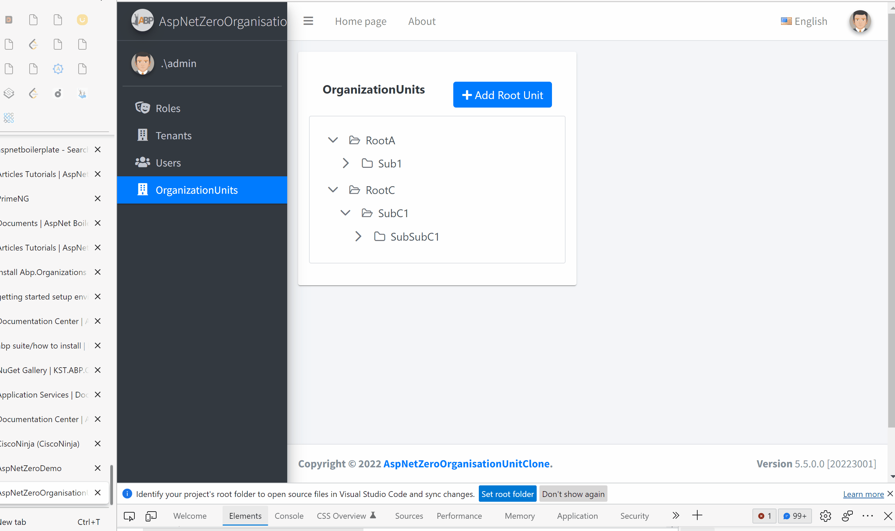

<h1>Overview</h1>

This project demonstrates how to recreate the organsational unit feature exactly as it is on the commercial AspNetZero version

<h1>Features</h1>

<ul>
    <li>
       Create Root Unit
    </li>
    <li>
        Edit Units
    </li>
    <li>
        Add Sub-Unit
    </li>
    <li>
        Delete Unit
    </li>
</ul>

<h1>Features to be added</h1>

<ul>
    <li>
       Drag and drop Units
    </li>
    <li>
        Unit Members management
    </li>
    <li>
        Unit Roles Management
    </li>
</ul>

This project uses ASP.NET Boilerplate [ASP.NET Boilerplate](https://aspnetboilerplate.com/Pages/Documents). 

User Interface is based on [AdminLTE theme](https://github.com/ColorlibHQ/AdminLTE). 
and [PrimeNG](https://primefaces.org/primeng/showcase/#/)
 

[MIT](LICENSE).

<h1>Project Demo</h1>

